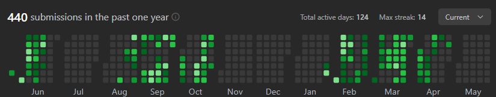

<!-- Banner -->

  

<strong><em>"Brains for logic, AI for magic"</em></strong>

<!-- Introduction -->
<h1 align="center">Hello World!👋, I'm Nihal</h1>
<h3 align="center">🚀 Passionate AI/ML Developer | MERN Stack Enthusiast | DSA Expert </h3>

  

---
<h2 align="center">Solved 400+ Problems on Various Coding Platforms Like Leetcode,Coding Ninjas & GFG</h2>

  
  
  
 

---

### 🧠 Technologies & Tools

  

---

### 📊 GitHub Stats

  
  

---

### 🔥Some of my recent projects
| Name | Description | Tech Stack |
|------|-------------|------------|
| 🔍 **AI Resume Analyzer** | NLP-based resume parser and evaluator using Gemini | `Python`, `NLP`, `Streamlit`, `Gemini API` |
| 🛡 **SecureNet MLOps** | Intrusion detection with MLOps tools like DVC, MLflow | `Scikit-learn`, `MLflow`, `DVC`, `BentoML` |
| 🧠 **Super-Resolution GAN** | Enhancing low-res images using deep learning | `TensorFlow`, `Keras`, `OpenCV` |
| 📦 **Student Marks Prediction** | A computational ML model that uses ML algorithm to predict marks of a student | `ML`, `Python`, `Streamlit`, `Regression` |

---
### 📫 Connect with me  

  
  
  

---
